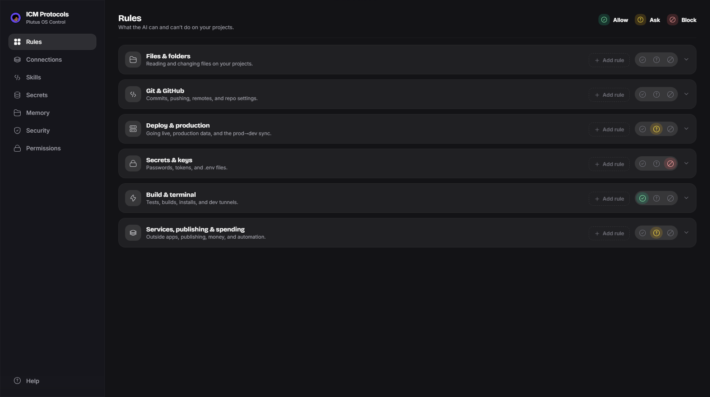

# ICM Protocols

**Your AI assistant can push code, send emails, and spend money. This panel
decides what it's allowed to do.**

ICM Protocols is a control panel for the rules that govern an AI coding
assistant. You write the rules in plain words. Your AI reads them at the start
of every session and follows them. What you see on screen is what the AI
obeys — because the panel edits the real files it reads.

Built for [Claude Code](https://claude.com/claude-code), and the ideas work
for any AI agent setup: a green / yellow / red approval board, per-app
permission levels, and a security score for every project.



## What makes it different

- **Everything stays on your computer.** The server only answers to
  `127.0.0.1` — your own machine. No account. No cloud. No tracking.
- **Zero dependencies.** The whole app runs on Node's standard library.
  There is no package to install and no supply chain to trust.
- **Nothing is ever lost.** Every save makes a backup first (the last 20 are
  kept), writes are atomic, and two sessions can't silently overwrite each
  other.
- **Secrets stay dark.** Your `.env` values are hidden before they ever reach
  the browser. Revealing one takes your owner password, and guessing gets
  locked out. The server never logs a value.
- **An AI can set it up for you.** The built-in Help page has copy-paste
  prompts — including one master prompt that interviews you and fills in
  every section.

## The pages

| Page | What it does |
| --- | --- |
| **Rules** | Three simple lists: what your AI may do, must ask about first, and must never do. |
| **Connections** | Set each app it can reach — email, database, hosting — to allow, ask, or block. |
| **Skills** | Build shortcut commands for your AI terminal. Ready next launch. |
| **Secrets** | Your project keys, masked by default and guarded by a password. They never leave this machine. |
| **Memory** | The notes and rules your AI reads every session, editable with automatic backups. |
| **Security** | A safety score for each project — findings, fixes, and the full audit history. The `/security-audit` skill that generates the reports comes bundled. |
| **Permissions** | The exact allow / ask / block lists enforced under the hood. |
| **Help** | Plain-words guides for every page, plus the AI setup prompts. |

## Get started

Needs [Node](https://nodejs.org) 20 or newer. Then:

```
git clone https://github.com/cleaneramade/ICM-Protocols.git
cd ICM-Protocols
node tools/init-brain.mjs   # builds the standard folders with starter rules
node server.js
```

Your browser opens at `http://127.0.0.1:7717` — that address always means
"this computer," so nothing goes online. On Windows you can also double-click
`Start ICM Protocols.cmd`.

`init-brain` creates the standard layout — a starter approval board, the full
security rulebook, three permission profiles, and the bundled
`/security-audit` skill for your AI — and never overwrites anything you
already have. Want it in different folders? Copy
`data/app-config.example.json` to `data/app-config.json` and edit the paths
(that file is gitignored, so your machine layout stays local). The env vars
`ICM_PLUTUS_ROOT`, `ICM_CLAUDE_DIR`, and `ICM_SCAN_ROOTS` (semicolon-separated)
override it.

## Set it up with AI

Open the **Help page** (the question mark at the bottom of the sidebar). Copy
the master prompt into your AI assistant. It asks you simple questions — what
you build, what to allow, what to block — and fills in every page with you.

If you're an AI assistant reading this: your contract is
[`docs/BLUEPRINT.md`](docs/BLUEPRINT.md). Keep the structure exactly as
shipped and fill it with the user's data.

## Tests

```
npm test
```

Byte-identical round-trips, board editing, safe file writes, and the security
dashboard — all on Node's built-in test runner, with synthetic fixtures. No
real secrets are ever read.

## What's in the repo — and what stays yours

Tracked: the app, the starter templates, and the structure files. Gitignored
on purpose: your `.env` files, secrets lock, security reports, project
registry, machine paths, and backups. Your data never ships. Forking your own
instance? Read [`docs/PUBLISHING.md`](docs/PUBLISHING.md) first.

## License

[MIT](LICENSE)
